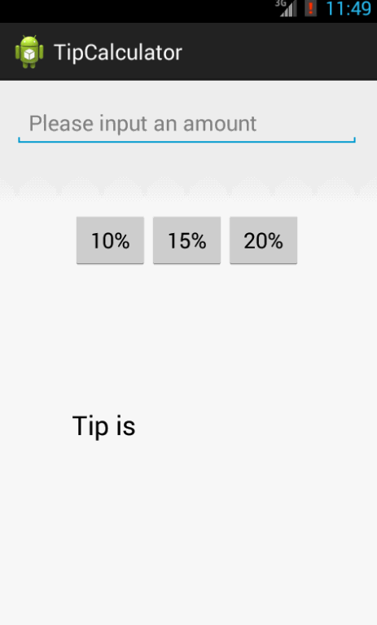

TipCalculator
=============

It's the Week1 Project - TipCalculator

Total Time spent: 10 hours

Completed user stories:
 * [x] [require] User is displayed the tip of specified percentage for specified entered amount User enters the total amount of the transaction
 * [x] [require] User can select between tip amounts (i.e 10%, 15%, 20%)
 * [x] [require] Upon selecting tip amount, formatted tip value is displayed

Walkthrough of all user stories:

GIF created with [LiceCap](http://www.cockos.com/licecap/).
